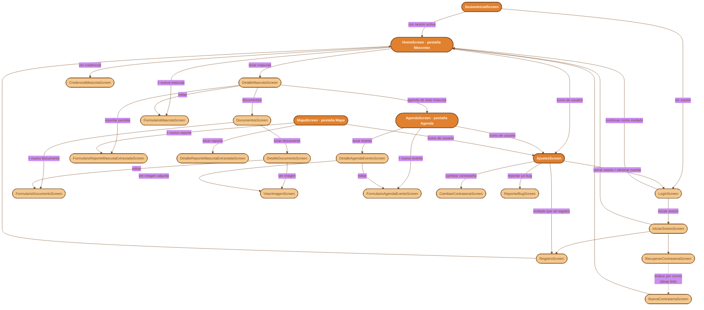

# Mapa de navegación — Patas al Día

Diagrama de flujo con las ~24 pantallas de `lib/presentation/screens/` y cómo se llega de una a otra (`Navigator.push`, deep links, pestañas). No es un UML de clases — es un mapa de navegación, pensado para ver de un vistazo qué pantalla abre a cuál.

Se arma leyendo directamente los `Navigator.push`/`MaterialPageRoute` de cada pantalla (no es un diseño a priori) — si el código de navegación cambia, este archivo hay que actualizarlo a mano, no se regenera solo.

**Versión interactiva (con zoom real, arrastre y pellizco):** `mapaNavegacion.html`, en esta misma carpeta — ábrelo directo en el navegador. El diagrama de abajo es la versión estática, para verlo sin salir de VS Code/Obsidian/GitHub.

## Notas

- **Las 3 pestañas de `NavegacionPrincipalScreen`** (Mascotas/Agenda/Mapa) tienen cada una su propio `Navigator` interno — cambiar de pestaña no reinicia la pila de la pestaña anterior (ver `screens/navegacionPrincipalScreen.md` si existe, o el comentario en el propio archivo).
- **`AjustesScreen`** no es una pestaña — se llega a través de `MenuUsuarioAvatar`, el ícono de usuario que aparece en el `AppBar` de las 3 pestañas.
- **`VisorImagenScreen`** es una pantalla terminal (solo muestra una imagen a pantalla completa) — se llega desde Documentos y desde Agenda (documento adjunto a un evento), pero no navega a ningún lado más.
- **`RecuperarContrasenaScreen` → `NuevaContrasenaScreen`** no es un `Navigator.push` directo — pasa por un correo real con un deep link (`patasaldia://reset-password`), por eso la flecha punteada.
